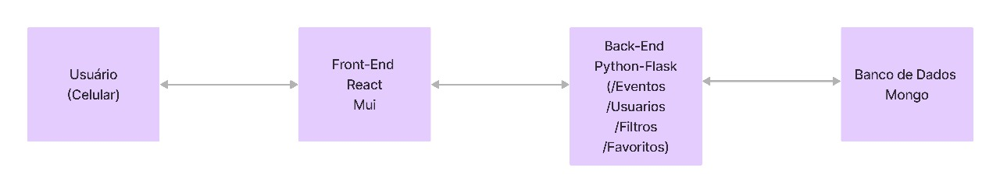

# SPRINT SESSION - DIREITO A CIDADE PROS JOVENS DE HELIÓPOLIS

# Acesso à Cidade - Frontend

Este repositório contém o código do frontend para o projeto "Acesso à Cidade", desenvolvido durante o sprint de 2024-1 no Insper. O projeto visa melhorar a acessibilidade urbana através de uma interface interativa e amigável. As tecnologias utilizadas foram React e MUI.

## Índice
- [Recursos](#recursos)
- [Instalação](#instalação)
- [Uso](#uso)
- [Estrutura do Código](#estrutura-do-código)
- [Explicação do Código](#explicação-do-código)


## Recursos
- Interface amigável com informações de acessibilidade
- Design responsivo para diversos dispositivos
- Integração com serviços backend para dados em tempo real

## Instalação
Para obter uma cópia local e executá-la, siga estes passos simples.

### Pré-requisitos
- Node.js e npm instalados na sua máquina.

### Passos para Instalação
1. Clone o repositório
    ```sh
    git clone https://github.com/insper-classroom/sprint-2024-1-acesso-a-cidade-2-front.git
    ```
2. Navegue para o diretório do projeto
    ```sh
    cd sprint-2024-1-acesso-a-cidade-2-front
    ```
3. Instale as dependências
    ```sh
    npm install
    ```

## Uso
Para iniciar, execute:
```sh
npm run dev
```

## Estrutura do código
Uma visão geral da estrutura do projeto

- `src/`: Contém o código-fonte do projeto.
  - `components/`: Componentes React reutilizáveis.
  - `pages/`: Páginas principais da aplicação.
  - `services/`: Serviços para comunicação com o backend.
  - `assets/`: Arquivos estáticos como imagens e estilos.
  - `App.js`: Componente principal da aplicação.
  - `index.js`: Ponto de entrada da aplicação.

## Explicação do código

### 'src/components/'
Contém componentes React reutilizáveis como botões, formulários e outros elementos de interface. Esses componentes são projetados para serem reutilizados em várias partes da aplicação, promovendo a consistência e facilitando a manutenção do código.

### 'src/pages/'
Contém os componentes de página que representam diferentes rotas na aplicação. Cada arquivo nesta pasta corresponde a uma página específica da aplicação, como a página inicial, páginas de detalhes, etc.

### 'src/services/'
Contém funções e módulos que realizam a comunicação com a API backend. Esses serviços são usados para buscar, enviar e manipular dados, abstraindo a lógica de comunicação do restante da aplicação.

### 'src/assets/'
Contém arquivos estáticos como imagens, ícones e estilos CSS. Esses arquivos são usados para melhorar a aparência da aplicação e fornecer uma experiência de usuário mais rica.

### 'App.js'
O componente principal da aplicação que configura as rotas e renderiza os componentes de página. Ele serve como o ponto central de configuração para a navegação dentro da aplicação.

### 'index.js'
O ponto de entrada da aplicação onde o React é inicializado e o componente App é renderizado na DOM.

## Diagrama da Arquitetura do Projeto

 


## Backlog e Slides

[Projects Github](https://github.com/orgs/insper-classroom/projects/159/views/1)

[Slides](https://www.canva.com/design/DAGHXZyfqKQ/uEl6205QwkIEYVR2smDNqA/edit?utm_content=DAGHXZyfqKQ&utm_campaign=designshare&utm_medium=link2&utm_source=sharebutton)

## Developers

- [Esther Caroline](https://github.com/esthercaroline)
- [Caio Liberal](https://github.com/Caiolib)
- [Gabriel Rodrigues](https://github.com/rxdrigues)
- [Nina Savoy](https://github.com/ninasavoy)
- [Mateus Moreira](https://github.com/mmp052)


